<!-- _class: title -->
<!-- _paginate: false -->

# SDD 学习笔记

## 经验与感悟分享

---

# 什么是 SDD

SDD，即 Spec-Driven Development，规格驱动开发。

  
<strong>编码前</strong>形成足够明确、可以验证的目标与设计约束

  
<strong>实施时</strong>让规格约束代码、测试和迭代范围

  
<strong>取得证据后</strong>判断实现是否符合预期，必要时修正规格或代码

文档深度随风险调整。局部变化可以简写，高风险边界需要更完整的设计。

---

# AI 协作中的速度与发散

  

    <h2>代码生成更快</h2>
    <ul>
      <li>样板代码和重复修改的成本下降</li>
      <li>边界清楚的小范围需求可以快速实施</li>
    </ul>
  

  

    <h2>复杂系统更容易偏离</h2>
    <ul>
      <li>未经核实的前提进入实现</li>
      <li>目标、状态和责任边界逐渐混乱</li>
      <li>缺少证据时，无法判断是否完成</li>
    </ul>
  

生成速度提高后，错误方向也会更快进入代码。人的重点转向问题定义、约束设计、判断和核验。

---

# 两条轴线组成完整闭环

  
<strong>活动时间轴</strong>明确目标、核实现状、设计边界、裁决取舍、推导任务、实施、验证与同步

  
<strong>文档信息地图</strong>01–09 分别保存问题、设计、决定、验证、任务和反馈

  
<strong>01–07 Spec</strong>保存当前有效的目标、边界、行为、决定和证明方式

  
<strong>08 Tasks</strong>保存当前事实、近期增量和实际完成记录

  
<strong>09 Feedback</strong>裁决新证据，定向回写发生变化的权威位置

---

<!-- _class: dense -->

| 位置 | 唯一负责的内容 | 主要更新触发 |
| --- | --- | --- |
| 01 Problem | 为什么做，什么算成功 | 目标、范围、成功标准或问题基线变化 |
| 02 Architecture | 静态边界、职责、所有权 | owner、依赖方向或架构不变量变化 |
| 03 Runtime | 流程、状态、生命周期 | 事件、转移、时序或提交点变化 |
| 04 Contracts | 跨边界可依赖规则 | 输入输出、权限或兼容承诺变化 |
| 05 Failures | 失败传播与恢复责任 | 失败分类、重试、清理或未知结果变化 |

每类规则只在一个位置权威定义，其他文档引用编号和当前任务需要的摘要。

---

<!-- _class: dense -->

| 位置 | 唯一负责的内容 | 主要更新触发 |
| --- | --- | --- |
| 06 Decisions | 关键取舍及理由 | 机制选择、代价或重审条件变化 |
| 07 Test Plan | 证明承诺的方式 | 现有检查无法证明目标或风险 |
| 08 Tasks | 当前事实与近期变化 | 基线、Gap、顺序或执行范围变化 |
| 09 Feedback | 评审、裁决与传播 | 新证据需要改变已接受规格 |

06 可以在任何阶段产生；09 负责裁决和路由，不取代 01–08 的权威结论。

---

# 01 Problem：先定义完成

  

    <h2>问题与现实</h2>
    <ul>
      <li>Background：谁遇到什么问题</li>
      <li>Current State：Fact / Assumption / Unknown，并附版本、测试或调查入口</li>
    </ul>
  

  

    <h2>目标与边界</h2>
    <ul>
      <li>Goal：可观察的产品结果</li>
      <li>Stage Goal：Architecture / Capability</li>
      <li>Non-goal：本次明确不做什么</li>
      <li>SC-XX：Given / When / Then</li>
    </ul>
  

Quality Attributes 写成可度量场景。Unknown 与 Stop condition 决定何时可以进入设计。

---

# 02 Architecture：边界与所有权

  
<strong>Glossary</strong>给关键术语一个唯一含义，并列出应避免的近义词

  
<strong>System Boundary</strong>说明 Inside、Outside、入口和系统无法最终控制的结果

  
<strong>Components</strong>用 May 与 Must not 定义职责边界

  
<strong>Ownership</strong>明确状态或资源的创建、权威 owner、修改、结束与观察责任

需要取舍时，用 mini-ATAM 检查 Driver、Tactic、Trade-off、Risk 与 Evidence。

---

# 03 Runtime：一次操作如何收敛

<ol class="process">
  <li><strong>Success flow</strong>入口、处理者、状态或数据效果、调用方可观察结果</li>
  <li><strong>Alternate / Failure</strong>关键分支、失败事件和最终可见状态</li>
  <li><strong>State machine</strong>Current、Event、Guard、Next 与 Side effect</li>
  <li><strong>Authority</strong>谁能请求或报告事件，权威 owner 核对什么证据</li>
  <li><strong>Lifecycle</strong>Create、Run、End、Cleanup 的责任与失败收敛</li>
</ol>

外部动作还要标明 Commit point、Timeout meaning、查询或幂等能力，以及权威观察入口。

---

# 04 Contracts：跨边界可依赖的规则

<table>
  <thead><tr><th>部分</th><th>需要写清的内容</th></tr></thead>
  <tbody>
    <tr><td>Purpose / Ownership</td><td>边界为何存在，由谁提供和维护，哪些调用方可以依赖</td></tr>
    <tr><td>Input / Output</td><td>必需字段、约束和调用方可以依赖的返回内容</td></tr>
    <tr><td>Conditions / State</td><td>前置条件、后置条件和状态效果</td></tr>
    <tr><td>Failure / Control</td><td>领域失败、幂等、取消、超时、并发和兼容语义</td></tr>
    <tr><td>Authorization / Boundaries</td><td>谁可以调用；Must 与 Must not</td></tr>
  </tbody>
</table>

Cancellation、并发和兼容语义只在相关时补充，但相关时必须写清。

---

# 05 Failures：失败后由谁负责

<ul class="policy-list">
  <li><strong>错误语言</strong>领域失败怎样表达和传播，调用方能够观察到什么</li>
  <li><strong>Retry / Idempotency</strong>唯一重试责任方、预算和同一请求的重复语义</li>
  <li><strong>Rollback / Cleanup</strong>部分构造、Shutdown、补偿与清理怎样收敛</li>
  <li><strong>Final state</strong>非法转移如何拒绝，外部结果未知时怎样查询或人工恢复</li>
  <li><strong>Failure ID</strong>Detect、Propagate、Recovery owner、Action、Final state 与 Evidence</li>
</ul>

超时后缺少查询或幂等能力时，结果保持 Unknown，不能直接推断失败并重试。

---

# 06 Decisions：保存一个关键取舍

<ol class="process">
  <li><strong>Context</strong>Conflict、事实基线、Invariant、Drivers 与 Unknowns</li>
  <li><strong>Alternatives</strong>比较不变量适配、代价、复杂度、可逆性与影响范围</li>
  <li><strong>Decision</strong>明确接受什么，以及本次不决定什么</li>
  <li><strong>Consequences</strong>获得什么、付出什么、新增哪些责任</li>
  <li><strong>Deferred</strong>说明延后原因、重审条件和退出机制</li>
</ol>

ADR 编号表示信息归属。决定可以在目标、设计、实施或验收阶段产生。

---

# 07 Test Plan：实施前定义证据

  
<strong>测试范围</strong>Unit、Component、Integration、E2E

  
<strong>验证性质</strong>State、Contract、Failure、Architecture、Isolation

  
<strong>测试用途</strong>Smoke、Regression、Acceptance

<table class="spaced-top">
  <thead><tr><th>状态</th><th>含义</th></tr></thead>
  <tbody>
    <tr><td>PASSED / FAILED</td><td>在指定基线上实际通过或失败</td></tr>
    <tr><td>FLAKY / ENV_ISSUE</td><td>环境或稳定性问题，需要说明影响</td></tr>
    <tr><td>SKIPPED / DEFERRED / UNVERIFIED</td><td>没有取得所需证据，不等于通过</td></tr>
  </tbody>
</table>

---

# 从成功标准追到实际证据

Traceability Matrix 检查每项承诺是否有设计依据、测试、任务和实际证据。

---

# 08 Tasks：从 Gap 推导增量

  
<small>CURRENT</small><strong>当前事实</strong>绑定版本和证据，并随任务推进刷新

  
<small>GAP</small><strong>下一项差距</strong>当前最重要、可以独立收口的一项

  
<small>TARGET</small><strong>目标规格</strong>SC 与已接受设计描述的结果

Task = 从 Current 到 Target 的最小可验证变化

Phase 按能力成熟过程组织。Accepted Design Constraints 跨多个 Task 持续成立。

---

# Task Contract：执行边界

| 字段 | 需要写清的内容 |
| --- | --- |
| Identity / Goal | Type、Status，以及完成后可观察的结果 |
| References / Preconditions | 真正约束本任务的 01–07 条目；为什么现在可以开始 |
| Allowed scope | 允许改变的职责区域，以及必要接缝和理由 |
| Must / Must not | Goal 所需的最小事实；最可能发生的范围扩张或边界破坏 |
| Verify | 编码前定义的定向、回归和边界检查 |
| Handoff / Design Delta | 后续事项；新证据推翻已接受规格时的变化请求 |

过去只保留结果，当前 Task 写全字段，未来 Phase 只保留目标和方向。

---

# 09 Feedback：人工裁决卡

  
<strong>Facts</strong>事实是什么，证据是否支持当前描述

  
<strong>Decision</strong>先锁定 Invariant，再选择落实它的 Mechanism

  
<strong>Why</strong>为什么这样选，代价和可逆性是什么

  
<strong>Deferred</strong>本次明确延后什么，何时重审

  
<strong>Verification</strong>怎样知道决定有效，接受后需要传播到哪里

Review 保存裁决与传播计划。最终规则仍回到负责它的 01–08 权威位置。

---

# Design Delta 的反馈路径

只有新证据推翻已接受规格时才进入 Design Delta。局部实现选择留在 Code 与当前 Task。

---

# 完成状态必须分开

  DraftAcceptedPropagatedImplementedVerified

  
<strong>Task Done</strong>Goal 达成，必需 Verify 通过，Must not、依赖方向和修改范围保持

  
<strong>闭环完成</strong>没有阻塞完成的 Design Delta，已传播接受的决定并刷新 Current Facts

