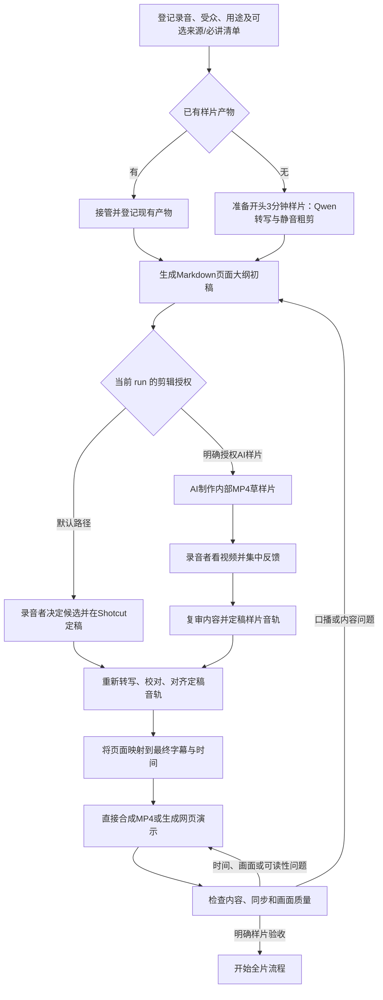

# 音频优先的讲解视频工作流


流程图已单独保存：[音频优先讲解视频工作流图](../.agent/skills/video-workflow/references/音频优先讲解视频工作流图.md)。
更新日期：2026-10-03

## 1. 目标和边界

由 [video-workflow 总控 skill](../.agent/skills/video-workflow/SKILL.md) 协调音频转写、内容审阅、样片剪辑和视频演示。先从录音开头连续 3 分钟制作样片，再决定是否处理完整录音。样片通过人工验收前，不启动全片转写或剪辑。

默认路径由 AI 提供识别稿、候选切点和大纲；录音者在 Shotcut 审听、剪辑和确认。当前 `pilot` 的前三分钟样片另有明确授权：AI 制作一条带临时字幕的内部 MP4 草样片，录音者看完后集中反馈一次，AI 据此定稿。口播不清楚的地方保留待判断，补录仍由录音者决定。

工作文件、模型、转写稿、字幕和工程放在 Git 忽略目录 `.local/video/<run-id>/`。`workflow.json` 只存文件路径、哈希、依赖关系、阶段、问题处理状态和审批状态；不保存录音、转写正文或字幕正文。不得通过外部 MCP 发送媒体或转写稿。

## 2. 两条反馈回路



**内容回路**保留稳定页面、问题和补录 ID。引用事实和指出遗漏时，只对照本轮明确声明的资料或必讲清单。默认逐项处理；本次样片把清单留作内部剪辑依据，待草样片的一次集中反馈后记录处理结论。内容 gate 获录音者确认后，才将草剪转为定稿音轨。

**演示质量回路**检查旁白与页面对应、音画同步、文字可读性和切换效果。纯视觉与时间问题回到 MP4 合成或网页演示修改；发现内容或口播问题则回到内容回路。若定稿音轨随之改变，重新生成校对稿、字幕、页面映射和演示。

## 3. 状态与阶段

状态助手位于 `.agent/skills/video-workflow/scripts/workflow-state.ps1`。在 PowerShell 中从仓库根目录执行：

```powershell
$state = '.agent/skills/video-workflow/scripts/workflow-state.ps1'
$sourceAudio = Read-Host '录音文件路径'
& $state -Action initialize -RunId pilot -SourceAudio $sourceAudio
& $state -Action reconcile -RunId pilot
& $state -Action status -RunId pilot
```

已有 `workflow.json` 时恢复状态，不要重新初始化。接管已有样片时先登记文件和依赖，再创建初稿；文件存在不会自动带来人工批准。文件哈希变化会让依赖产物标记为过期，并关闭相应审批门槛；旧文件会保留以便比较。

新样片可运行 `prepare-pilot.ps1 -RunId <run-id> -InputAudio <path>`，产物、UV 环境和模型缓存会使用该 run ID。对超过 180.05 秒的音轨，CLI 会在模型推理前调用工作流状态助手，重核文件哈希并确认输入路径和哈希对应当前阶段允许的音频产物。获批补录可能使样片超过三分钟；在 `sample_final_transcript` 阶段只允许对齐已登记的 `sample-final-audio`。全量识别要求 `full_transcript` 且输入为 `source-audio`；全量定稿对齐要求 `full_final_transcript` 且输入为 `full-final-audio`。

阶段按顺序推进：`sample_prepare` → `sample_outline` / `sample_content_review` → `sample_shotcut` 或 `sample_ai_edit` → `sample_final_transcript` → `sample_captions` → `sample_web_demo` → `sample_quality_review`。`sample_web_demo` 是兼容旧状态的阶段名，也用于直接合成 MP4。内部草样片可在 `sample_content_review` 阶段制作，不代表任何 gate 已获批准。AI 音轨定稿由 `ai_audio_export` 记录，原 Shotcut 路径由 `shotcut_export` 记录。只有 `sample_acceptance` 获批后，才进入 `full_*` 阶段。用户表示“大体满意”是反馈，不自动构成验收。样片验收须登记当前大纲、定稿音轨、最终 SRT、演示和质量审阅文件；输入或问题结论变化会使相关审批过期。

状态助手不记录问题描述。AI 在独立审阅文件中保存结论；默认逐项处理，当前样片则在集中反馈后用 `set-item` 记录问题 ID、状态和决定。内容 gate 仅在当前大纲与审核文件均已登记、最新审核文件中的每个问题 ID 都有状态记录、所有已记录问题处于 `accepted` 或 `resolved`，并由录音者确认 `set-gate -Decision approved` 后放行。声明的参考资料和必讲清单也应注册为文件依赖，使来源更新会使审核过期。

## 4. 样片产物和内容回路

样片默认采用开头连续 180 秒。已有产物时直接登记当前源 SRT、对齐 JSON、样片 WAV、Auto-Editor 时间线、Shotcut MLT 工程和 A/B/C 剪辑审阅清单；不要为了初始化而重跑模型或覆盖工程。

`outline.md` 是早期页面题纲，不生成 `.pptx`。每页包括稳定页面 ID、标题、核心信息、要点、画面构想、转写版本、字幕 cue 与时间范围、问题 ID 和补录 ID。定稿音轨生成后，将暂定映射更新到最终 SRT。模板见 [outline.md](../.agent/skills/video-workflow/templates/outline.md)。

默认路径每轮检查最新大纲与问题清单，由录音者逐项决定。当前 AI 样片路径使用已有清单和大纲做草剪，不再要求逐项审阅；录音者看一条 MP4 后集中指出口播、节奏和画面问题。AI 将反馈关联到页面、原时间码和实际切点；内容确认后登记当前审核记录并定稿。获批补录单独保存，不凭机器识别自行补写。

## 5. 最终音轨、字幕和演示

默认路径由录音者在 Shotcut 中审听、确认切点、录入获批补录并导出音轨。当前获授权的 AI 样片路径保留原始录音、源时间码和全部实际切点；明显长空白缩至约半秒，边界不清或难以无痕裁切的口播保留到集中反馈。Auto-Editor 时间线仍只是候选。CLI-Anything Shotcut 仅创建或检查 MLT 文件，不控制 Shotcut 图形界面。

草样片字幕依据草剪音轨重新识别，只作内部预览并标明待核对。收到集中反馈并完成音轨定稿后，重新运行 Qwen 生成识别校对稿，再对校对稿对齐，生成最终 SRT 和对齐 JSON。剪辑或补录后不可沿用旧时间戳。页面映射、字幕、MP4 和可选网页时间线均依赖最终音轨。

当前样片直接导出 1920×1080、30 fps、H.264/AAC MP4，画面显示中文字幕，并交付独立 SRT。P01–P04 图示素材本身不含字幕；字幕在视频剪辑合成时由独立图层叠加。录音者对草样片的集中反馈要求自然紧凑地精修小停顿、口癖和识别同音字；每行字幕末尾不留标点，字幕外围不画文本框。按定稿音轨的播放时间切换图示；P03 保持一页逐项呈现，并标注“文档深度随风险调整”。网页演示和 Shotcut 导出仍可用于其他获授权路径。检查开头、中段、结尾及各修正点的音画与字幕；样片验收后才扩展至完整录音。

重复操作由 `video-workflow/scripts/media_tools.py` 承担：从源时间码剪辑清单生成音轨与映射，从校对后的对齐结果及逐行文本生成无行尾标点的 SRT，按连续页面时间清单合成 MP4，并用 `ffprobe` 核查参数。音轨剪辑入口只接受不超过 180.05 秒的样片源。每期的剪辑清单、字幕文本、无字幕页面图片和场景清单放在 Git 忽略的 run 目录；工具不自动选切点或更改口播。`register-sample-output.ps1` 的 `draft` 动作在内容批准前登记内部草样片，`audio` 和 `delivery` 分别登记定稿音轨与交付产物；草样片和定稿视频均把页面图片登记为依赖，但不批准内容或样片验收。自动检查不能确认听感、同音字、隐私和句意，这些仍通过录音者观看样片核对。

## 6. 工具、版本与来源

| 工具 | 当前锁定 | 用途 |
| --- | --- | --- |
| Qwen3-ASR / ForcedAligner | `qwen-asr==0.0.6`、Python 3.12；`Qwen/Qwen3-ASR-0.6B` 与 `Qwen/Qwen3-ForcedAligner-0.6B` | 中文识别、字/词级对齐；UV 项目及 `uv.lock` 管理 |
| Auto-Editor | 官方 Windows 可执行文件 `31.6.0` | 生成静音粗剪候选，margin 为 0.2 秒；不自动定稿 |
| CLI-Anything Shotcut | `cli-anything-shotcut==1.0.0`、Python 3.12 | 管理或检查 MLT 文件；独立 UV 项目 |
| web-video-presentation | 上游 `v1.2.2` 适配版 | 按定稿音轨播放时间呈现页面；提供 PowerShell 入口 |

Qwen 0.6B 的识别准确度不预设达到 Whisper medium。锁定的 Qwen 实现把长音频分段后合并时间偏移；更换版本前重新核对最长分段行为。Auto-Editor 上游当前没有 PyPI 安装路径，因此暂用官方 Windows 可执行文件。FFmpeg 是外部工具。

模型、工具许可和上游来源见[公开来源索引](公开来源.md)。发布或升级时重新核对可变版本和许可证。第三方技能保留来源与许可说明；本地视频产物不提交 Git。

## 7. 验收

- 内部草样片可以先看；正式音轨定稿仍要求内容确认和有效的音轨导出记录。
- 定稿音轨变化会使旧字幕和页面映射过期；新字幕必须来自最终音轨与校对稿。
- 演示纯视觉/同步问题回视频合成或网页修改；内容问题回内容审核。
- 样片验收前不得处理完整录音。
- 抽查转写专有名词、切点与补录衔接；以人工校对结果评估样片识别质量。
- 新增公开示例需采用独立构造的虚构场景，不泄露资料提供者或其个人项目细节。
