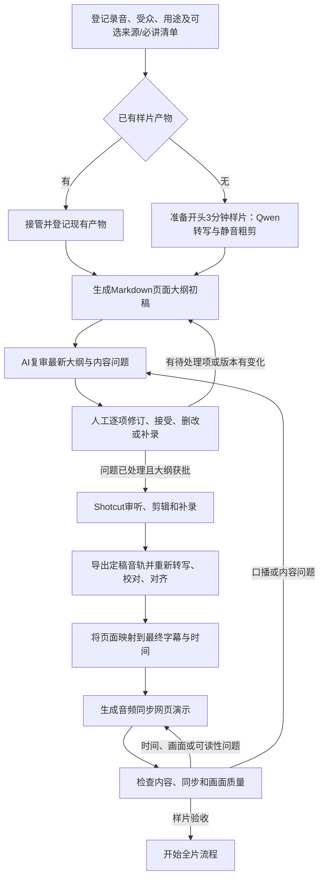

# 音频优先的讲解视频工作流


流程图已单独保存：[音频优先讲解视频工作流图](../.agent/skills/video-workflow/references/音频优先讲解视频工作流图.md)。
更新日期：2026-10-02

## 1. 目标和边界

由 [video-workflow 总控 skill](../.agent/skills/video-workflow/SKILL.md) 协调音频转写、内容审阅、Shotcut 定稿和网页演示。先从录音开头连续 3 分钟制作样片，再决定是否处理完整录音。样片通过人工验收前，不启动全片转写或剪辑。

AI 提供识别稿、静音切点候选、页面大纲和内容问题清单。用户校对文字、逐项处理内容问题、在 Shotcut 审听和编辑、录入获批补录，并确认每道验收门槛。AI 不自行删改音频或确认事实。

工作文件、模型、转写稿、字幕和工程放在 Git 忽略目录 `.local/video/<run-id>/`。`workflow.json` 只存文件路径、哈希、依赖关系、阶段、问题处理状态和审批状态；不保存录音、转写正文或字幕正文。不得通过外部 MCP 发送媒体或转写稿。

## 2. 两条反馈回路



**内容回路**先审阅大纲、口播连贯性和补录建议。每轮都复核最新版本，保留稳定页面、问题和补录 ID。引用事实和指出遗漏时，只对照本轮明确声明的资料或必讲清单；未声明来源时，只标记内部含糊、重复或衔接问题。所有问题都有人工处理结论且大纲获批后，才能进入 Shotcut 音轨定稿。

**演示质量回路**检查旁白与页面对应、音画同步、文字可读性和切换效果。纯视觉与时间问题回到网页演示修改；发现内容或口播问题则回到内容回路。若定稿音轨随之改变，重新生成校对稿、字幕、页面映射和演示。

## 3. 状态与阶段

状态助手位于 `.agent/skills/video-workflow/scripts/workflow-state.ps1`。在 PowerShell 中从仓库根目录执行：

```powershell
$state = '.agent/skills/video-workflow/scripts/workflow-state.ps1'
$sourceAudio = Read-Host '录音文件路径'
& $state -Action initialize -RunId pilot -SourceAudio $sourceAudio
& $state -Action reconcile -RunId pilot
& $state -Action status -RunId pilot
```

已有 `workflow.json` 时恢复状态，不要重新初始化。接管已有样片时先登记文件和依赖，再创建初稿；文件存在不会自动带来人工批准。文件哈希变化会让依赖产物标记为过期，并关闭相应审批门槛；旧文件会保留以便比较。

新样片可运行 `prepare-pilot.ps1 -RunId <run-id> -InputAudio <path>`，产物、UV 环境和模型缓存会使用该 run ID。对超过 180.05 秒的音轨，CLI 会在模型推理前调用工作流状态助手，重核文件哈希并确认输入路径和哈希对应当前阶段允许的音频产物。获批补录可能使样片超过三分钟；在 `sample_final_transcript` 阶段只允许对齐已登记的 `sample-final-audio`。全量识别要求 `full_transcript` 且输入为 `source-audio`；全量定稿对齐要求 `full_final_transcript` 且输入为 `full-final-audio`。

阶段按顺序推进：`sample_prepare` → `sample_outline` / `sample_content_review` → `sample_shotcut` → `sample_final_transcript` → `sample_captions` → `sample_web_demo` → `sample_quality_review`。只有 `sample_acceptance` 获批后，才进入 `full_*` 阶段。内容与样片验收都是独立 gate。样片验收必须同时登记当前页面大纲、定稿音轨、最终 SRT、演示和质量审阅文件。修改问题处理结论会使内容、音轨和样片审批过期。

状态助手不记录问题描述。AI 每轮在独立审阅文件中保存结论；人工逐项处理后，用 `set-item` 记录问题 ID、状态和决定。内容 gate 仅在当前大纲与审核文件均已登记、最新审核文件中的每个问题 ID 都有状态记录、所有已记录问题处于 `accepted` 或 `resolved`，并由人工执行 `set-gate -Decision approved` 后放行。声明的参考资料和必讲清单也应注册为文件依赖，使来源更新会使审核过期。

## 4. 样片产物和内容回路

样片默认采用开头连续 180 秒。已有产物时直接登记当前源 SRT、对齐 JSON、样片 WAV、Auto-Editor 时间线、Shotcut MLT 工程和 A/B/C 剪辑审阅清单；不要为了初始化而重跑模型或覆盖工程。

`outline.md` 是早期页面题纲，不生成 `.pptx`。每页包括稳定页面 ID、标题、核心信息、要点、画面构想、转写版本、字幕 cue 与时间范围、问题 ID 和补录 ID。定稿音轨生成后，将暂定映射更新到最终 SRT。模板见 [outline.md](../.agent/skills/video-workflow/templates/outline.md)。

每轮 AI 内容审核都检查最新大纲与最新问题清单，分别标出已解决、仍待处理和新出现的问题。人逐项选择修订、接受不改、删改或补录。修订后继续复审；接受不改、删改或补录决定必须关联到具体页面、cue 和时间范围。获批补录单独保存在 `pickup-script.md`，之后由用户在 Shotcut 加入音轨。

## 5. 最终音轨、字幕和演示

用户在 Shotcut 中审听静音候选、确认切点、录入获批补录并导出音轨。Auto-Editor 默认切点余量为 0.2 秒，只提供待审候选。CLI-Anything Shotcut 仅创建或检查 MLT 文件，不控制 Shotcut 图形界面。

对定稿音轨重新运行 Qwen 生成识别校对稿。用户试听并修正转写后，用 Qwen3-ForcedAligner 对每段不超过 180 秒的校对稿对齐，生成最终 SRT 和对齐 JSON。剪辑或补录后不可沿用旧时间戳。页面映射、字幕和网页时间线均依赖最终音轨。

网页演示使用音轨播放头驱动画面，支持播放、暂停、拖动与场景跳转。若最终 SRT 对齐或 cue 时间错误且音轨未变，回到校对稿对齐，再更新页面映射和网页演示；若只是场景时间线、画面或可读性问题，回到网页演示修改。用户可以在 Shotcut 中复核并导出包含音轨的视频。抽听术语、数字、切点和补录接缝；样片验收后才扩展至完整录音。

## 6. 工具、版本与来源

| 工具 | 当前锁定 | 用途 |
| --- | --- | --- |
| Qwen3-ASR / ForcedAligner | `qwen-asr==0.0.6`、Python 3.12；`Qwen/Qwen3-ASR-0.6B` 与 `Qwen/Qwen3-ForcedAligner-0.6B` | 中文识别、字/词级对齐；UV 项目及 `uv.lock` 管理 |
| Auto-Editor | 官方 Windows 可执行文件 `31.6.0` | 生成静音粗剪候选，margin 为 0.2 秒；不自动定稿 |
| CLI-Anything Shotcut | `cli-anything-shotcut==1.0.0`、Python 3.12 | 管理或检查 MLT 文件；独立 UV 项目 |
| web-video-presentation | 上游 `v1.2.2` 适配版 | 按定稿音轨播放时间呈现页面；提供 PowerShell 入口 |

Qwen 0.6B 的识别准确度不预设达到 Whisper medium。锁定的 Qwen 实现把长音频分段后合并时间偏移；更换版本前重新核对最长分段行为。Auto-Editor 上游当前没有 PyPI 安装路径，因此暂用官方 Windows 可执行文件。FFmpeg 是外部工具。

模型、工具许可和上游来源见[公开来源索引](公开来源.md)。发布或升级时重新核对可变版本和许可证。第三方技能保留来源与许可说明；本地视频产物不提交 Git。

## 7. 验收

- 未处理完的问题、未批准的大纲或过期输入不能放行到 Shotcut 定稿。
- 定稿音轨变化会使旧字幕和页面映射过期；新字幕必须来自最终音轨与校对稿。
- 演示纯视觉/同步问题回网页修改；内容问题回内容审核。
- 样片验收前不得处理完整录音。
- 抽查转写专有名词、切点与补录衔接；以人工校对结果评估样片识别质量。
- 新增公开示例需采用独立构造的虚构场景，不泄露资料提供者或其个人项目细节。
